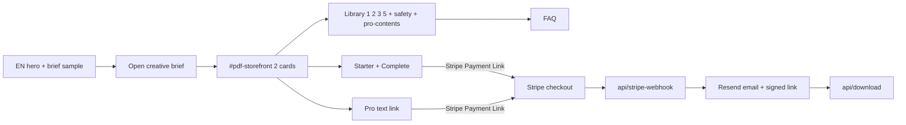

# Offer Architecture — CMO AI Content System

**Scope:** EN-only paid layer. Companion to [PRODUCT-POSITIONING.md](PRODUCT-POSITIONING.md).
**Single source of truth:** [config/sot.json](../config/sot.json). All paid copy, prices, page counts, and cover paths flow from there into the build. EN GEO/JTBD messaging (FAQ, `knowsAbout`, storefront head) also lives in SOT + [brand-seo.json](../config/brand-seo.json) — on `/en/` only; no separate SEO hub routes.

---

## 1. Free vs paid

### 1.0 Glossary (EN IA lock)

| Term | Meaning |
|------|---------|
| **Prompt Anatomy** | Brand (logo + entity footer only) |
| **Content AI System** | Product name (H1 once) |
| **Workflow** | Free interactive unit = spine prompts **1, 2, 3, 5** (“4 free workflows”) |
| **Prompt** | Copyable body / “Copy prompt” (hero CTA uses **workflow** language) |
| **Brief** | **Primary** free tool `#creative-brief` (open `#cb-builder`; hero CTA) |
| **Pro kit** | Full **10** offline |

**Hero trust chips:** Free to start · No sign-up · Reusable workflows (price lives on `#pdf-storefront`, not the hero).  
**Number story (FAQ/storefront):** Free: 4 workflows + brief. Pro: full 10 offline.  
**Method (one process):** Plan → Create → Check → Improve.  
**Usage (one sentence):** Copy → paste into ChatGPT or Claude.

| Layer | Surface | Format | Promise |
|-------|---------|--------|---------|
| Free | EN library (`/en/`) | Interactive spine + Pro contents catalog, progress of 4 workflows | 4 free workflows (prompts 1,2,3,5) + safety + brief; 4/6–10 in `#pro-contents` (not fake prompt cards); no sign-up |
| Free | `#creative-brief` (EN) | Browser-only creative brief builder | Assemble an image-ready prompt; copy / open image tools; ships on mirror too |
| Starter (Use) | `#pdf-storefront` card | 14-page PDF | Solo 30-day plan, offline, printable |
| Pro (Build) | text link under cards (`#pdf-card-pro`) | 30-page PDF + Markdown | Full prompt bodies — **not** a third grid card |
| Bundle (Install / Complete) | `#pdf-storefront` card (Best value) | 2 PDFs, one checkout | Team system; `$10.99` vs separately `$12.98` |

The **open brief builder** sits **above** the two kits. Library 1/2/3/5 (display 1–4) + `#pro-contents` sit **below**. The paid layer never appears on the LT site or the GitHub Pages mirror (commerce is EN-only, primary host only). `#creative-brief` is free and **does** ship on the mirror. 2-card UI ≠ deleting the Pro SKU.

**Roadmap alignment:** Free → storefront → Stripe fulfillment is **R1 (Ambition A)** — [roadmap.md](../roadmap.md), [todo.md](../todo.md), [MUST_TODO_STRIPE.md](../MUST_TODO_STRIPE.md). Extra browser tools after the spine are **R3 (light Ambition B)**, only after R1 exit. Deeper Install PDF/MD is **R4 (Ambition C)**. SaaS / new vertical kits stay parked.

---

## 2. Funnel map



**Path cut:** `#creative-brief` default = **open** `#cb-builder`. Storefront shows **2** cards; Pro is a text path. Does **not** render `comparisonTable` HTML (SOT data may remain for later).

---

## 3. File ownership (copy cascade)

Everything paid-facing originates in `config/sot.json` and the PDF HTML sources, then propagates through the build.

| Surface | File | Drives |
|---------|------|--------|
| Storefront head, cards, FAQ, prices, page counts (`comparisonTable` not rendered) | [config/sot.json](../config/sot.json) | Injected into EN build |
| SEO / OG meta | [config/brand-seo.json](../config/brand-seo.json) | EN `<head>` + OG image |
| EN page render | [scripts/build-locale-pages.js](../scripts/build-locale-pages.js) | `en/index.html` storefront + value cards |
| PDF interiors, covers, footers | Operator-local [docs/pdf-source/*.html](pdf-source/README.md) (gitignored) + committed [assets/pdf-covers/](../assets/pdf-covers/) | Buyer PDFs + cover PNGs |
| Fulfillment + emails | [api/_lib/fulfillment.js](../api/_lib/fulfillment.js) | Product names, follow-up copy |
| Post-purchase | [success.html](../success.html), [terms.html](../terms.html) | Family name, license |
| Page-count CI gate | [scripts/export-pdfs.js](../scripts/export-pdfs.js) | 14 / 30 page assertion |

**Rule:** change copy in the source (SOT or PDF HTML), then rebuild. Never hand-edit generated `en/index.html` or `public/` copies.

---

## 4. Regeneration commands

```bash
# 1. Edit config/sot.json + operator-local docs/pdf-source/*.html (see docs/pdf-source/README.md)

# 2. Regenerate visual assets (Playwright Chromium required)
npx playwright install chromium
npm run pdf:covers      # page 1 -> assets/pdf-covers/cmo-{starter,pro,bundle}-cover.png
npm run pdf:previews    # interior pages -> cmo-*-preview-{1,2,3}.png
npm run pdf:export      # buyer PDFs + page-count gate (14 / 30)

# 3. Rebuild EN storefront from SOT
npm run build

# 4. Validate
npm test
npm run test:fulfillment-config
```

---

## 5. Guardrails

- **Locale freeze:** v2 touches EN paid surfaces and SOT only. No edits to `lt/` or `data/lt-*.json`.
- **Mirror safety:** the GitHub Pages build sets `MIRROR_NOTE=1`, which omits `#pdf-storefront`. Never leak prices or Stripe links to LT or mirror.
- **Identifier stability:** see [PRODUCT-POSITIONING.md](PRODUCT-POSITIONING.md) section 4. Display strings rename; ids, blob paths, and cents stay.
- **Price/page sync:** `config/sot.json` `priceCents` and `pages` must match `api/_lib/fulfillment.js` `amountCents` and `scripts/export-pdfs.js` `expectedPages`. Tests in [tests/fulfillment-config.test.js](../tests/fulfillment-config.test.js) enforce the price half.
