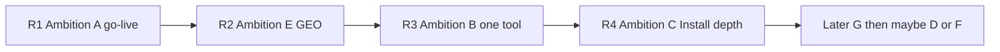

# Product roadmap — CMO AI Content System

**Canon sequence:** Ambition **A** → **E** → light **B** → **C**  
**Active tracker:** [todo.md](todo.md)  
**Ops detail (R1):** [MUST_TODO_STRIPE.md](MUST_TODO_STRIPE.md)  
**Agent contract:** [AGENTS.md](AGENTS.md) §0.2  
**Last updated:** 2026-08-11

**Verdict:** Close production commerce first; then GEO on one URL; then one more browser-local tool; then deepen offline Install kits. Do not open SaaS or a multi-kit catalog until R1 converts.

**Naming:** Roadmap phases are **R1–R4** / **Ambition A/E/B/C**. Do **not** call commerce “Phase A” — that label in [AGENTS.md](AGENTS.md) §0.1 means the EN free-surface (spine-first), which is already shipped.

---

## R1 — Ambition A: Close the cash register

| | |
|--|--|
| **Goal** | Live Stripe → webhook → Resend → Blob download on `promptanatomy.space` |
| **Owner** | Commerce (+ Orchestrator gate) |
| **Entry** | Repo SOT already has live Payment Links; `allowPlaceholderCheckout: false` |
| **Exit** | `GET /api/fulfillment-health` → `{ ok: true }`; live Starter (then Pro/Bundle) email + download ≤5 min; `success.html` poll works |
| **Primary docs** | [MUST_TODO_STRIPE.md](MUST_TODO_STRIPE.md), [DEPLOYMENT.md](DEPLOYMENT.md) §2.5, [memo_pdf.md](memo_pdf.md) |
| **Kill if** | Fulfillment cannot be made reliable after env + Blob are correctly set |

**In scope:** Blob upload, Vercel Production env, webhook signing, live purchase drills, commit/push redeploy.  
**Out of scope:** New product features, new browser tools, PDF content expansion, SaaS.

---

## R2 — Ambition E: GEO / AI-search distribution

| | |
|--|--|
| **Goal** | Stronger discovery on the **same** `/en/` URL — FAQ, `llms.txt` hubs, IndexNow signal |
| **Owner** | Content (+ QA for schema/claims) |
| **Entry** | R1 exit (cash register boringly works) |
| **Exit** | `frontFaq` maintained (≥8); hash hubs accurate; IndexNow post-deploy used; no invented ROI/stats; no new SEO hub routes |
| **Primary docs** | [docs/AGENT_SOT.md](docs/AGENT_SOT.md) §5, [docs/PRODUCT-POSITIONING.md](docs/PRODUCT-POSITIONING.md) §4, [AGENTS.md](AGENTS.md) §10.11–13 |
| **Kill if** | No attributable AI/search visits after sustained GEO work — reallocate to conversion on `/en/` |

**In scope:** `config/sot.json` / `brand-seo.json` JTBD copy, FAQ triple sync, `scripts/geo-surfaces.js` hub quality.  
**Out of scope:** `/en/ai-marketing-*` landing farms; lengthening path to first Copy.

---

## R3 — Ambition B (light): One more browser-local tool

| | |
|--|--|
| **Goal** | Exactly **one** new sessionStorage tool after spine `#block5`, before teasers |
| **Owner** | Curriculum (placement) → UI/UX + Content |
| **Entry** | R2 exit (or Orchestrator waives R2 if GEO baseline already green) |
| **Exit** | Tool ships EN-only (mirror OK); LT strip; e2e; hero → Prompt 1 Copy path unchanged; secondary to brief/tool only |
| **Primary docs** | [docs/CREATIVE_BRIEF_BUILDER.md](docs/CREATIVE_BRIEF_BUILDER.md) (pattern), [docs/LEGACY_GOLDEN_STANDARD.md](docs/LEGACY_GOLDEN_STANDARD.md), [AGENTS.md](AGENTS.md) §10.7 |
| **Kill if** | Tool becomes a pre-value wall or dual-primary CTA with the spine |

**In scope:** One local builder (e.g. pre-publish gate or weekly rhythm) — no account, no POST.  
**Out of scope:** Tool suite sprawl, I2V, Consistency Lock Lab, React port, SaaS.

---

## R4 — Ambition C: Offline Install depth

| | |
|--|--|
| **Goal** | Deeper Pro/Bundle Install — workshop / facilitator / Markdown vault richness |
| **Owner** | Commerce + Content (+ Curriculum for pedagogy) |
| **Entry** | R1 converting (at least one paid SKU proven end-to-end in production) |
| **Exit** | Use · Build · Install still feel different in **kind**; page-count gates pass; no login/dashboard claims |
| **Primary docs** | [docs/PRODUCT-POSITIONING.md](docs/PRODUCT-POSITIONING.md), [docs/OFFER-ARCHITECTURE.md](docs/OFFER-ARCHITECTURE.md), `docs/pdf-source/*` |
| **Kill if** | Buyers expect a live app after “system” language and bounce — tighten copy, do not add SaaS here |

**In scope:** PDF/MD depth, team-license clarity, workshop-ready assets.  
**Out of scope:** Accounts, hosted vault, Ambition F.

---

## Parked (not active roadmap)

| Ambition | Why parked | Reopen when |
|----------|------------|-------------|
| **F** — Controlled SaaS | Conflicts with PRODUCT-POSITIONING §3 (no login/dashboard) | Explicit Orchestrator scope + rewrite of §3 claims + budget |
| **D** — Vertical kit catalog | Dilutes focus before first kit monetizes | R1 converting and fulfillment is boringly reliable |
| **G** — Mother-brand consolidation | Org/multi-repo; must not block R1 | After R1; brand ops capacity |
| Template migration | Engineering debt, not product ambition | [docs/TEMPLATE_MIGRATION_BACKLOG.md](docs/TEMPLATE_MIGRATION_BACKLOG.md) when Orchestrator schedules |

---

## PR rule

Every product PR declares which **Ambition** (A/E/B/C) or **Parked** epic it serves. Ambition **F** or **D** scope without Orchestrator rewrite of this file → reject.
